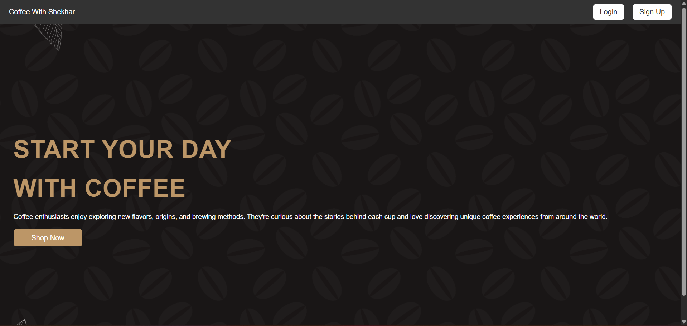
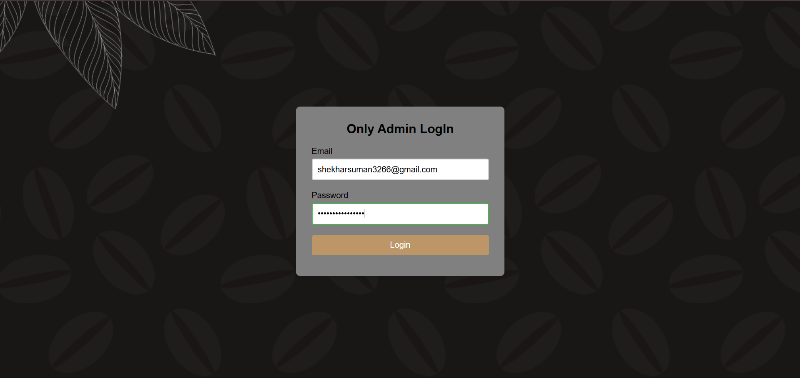
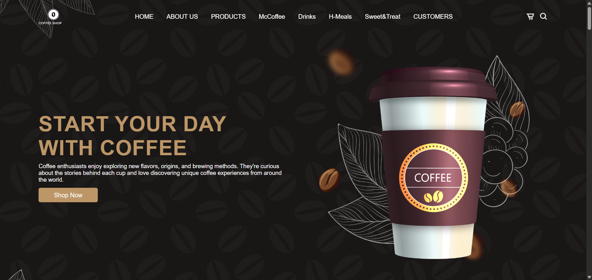
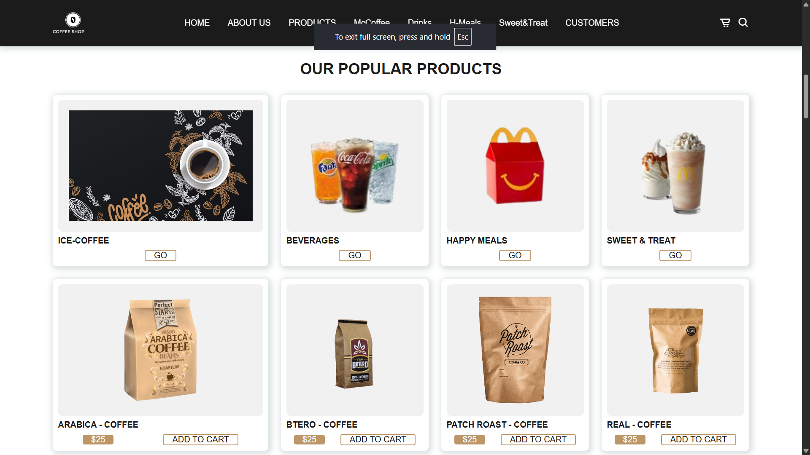

# Coffee With Shekhar

Coffee With Shekhar is a responsive coffee shop website built using HTML, CSS, and JavaScript. It includes a landing page, admin login page, product categories, customer reviews, and interactive navigation features.

## Features

- Responsive landing page
- Coffee shop product catalog
- Coffee, drinks, happy meals, and sweet treats sections
- Customer review section
- Admin login page
- JavaScript-based login validation
- Search box toggle
- Mobile navigation menu
- Scroll-based navbar shadow effect
- Organized image assets

---






---

## Technologies Used

- HTML
- CSS
- JavaScript
- Boxicons

## Project Structure

```text
Coffee/
├── index.html
├── README.md
├── CSS/
│   ├── style.css
│   └── styles.css
├── J.S/
│   └── login.js
├── LOGIN/
│   ├── login.html
│   └── signup.html
└── Coffee/
    ├── coffee.html
    ├── coffee.css
    ├── coffee.js
    └── image/
```

---

## How to Run

- Clone the repository
``` 
git clone https://github.com/shekhar-s93/Coffee.git 
```

- Open the project folder where you clone this repository
- Run index.html in your browser

### Log-In Details

```
    Email       : shekharsuman3266@gmail.com
    Password    : shekharsuman3266
```

 ---

## 👨‍💻 Author

**Shekhar Suman**

## 🎓 Education

**BACHELOR of SCIENCE IN INFORMATION TECHNOLOGY**  